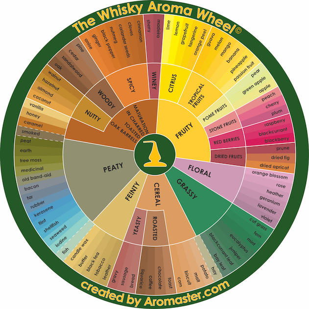

# docker-geoserver-flavors
Various Geoserver configurations, dockerized.

Simplemente, diferentes dockerizaciones de Geoserver según el tipo de configuración requerida (basado en extensiones).

Basamos la selección de nombres de los "sabores" en la siguiente imagen de referencia.

 

El número de version de la imagen docker, indica la version de Geoserver incluida. 

## Tabla de Sabores

| Flavor | Configuration                                                |
| ------ | ------------------------------------------------------------ |
| ginger | Alpine 3.11, OpenJDK 15, GDAL 2.1.4, Jetty 9.4.18, plugins: OGR, GDAL, import, JMS, CSS, printing, querylayer, sldservice |

